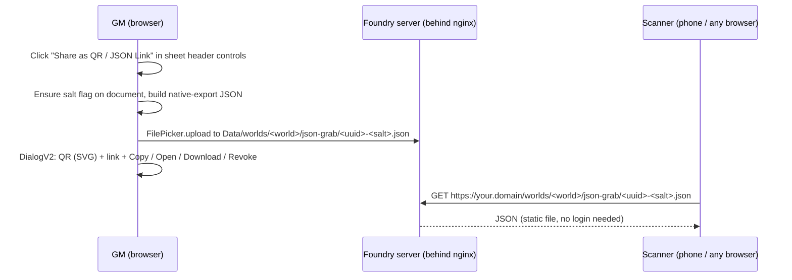

# JSON Grab: Development Plan

A Foundry VTT **v14** module that adds a control to every **Actor** and **Item** sheet header
which pops up a **QR code with a copyable HTTPS link underneath**. Anyone who scans the QR or
pastes the link (no Foundry login required) grabs that document's JSON in Foundry's native
export format.

Written against the official [Introduction to Module Development](https://foundryvtt.com/article/module-development/)
guide, with [farling42/fvtt-export-markdown](https://github.com/farling42/fvtt-export-markdown)
as the structural reference.

**Plan status:** M0 and M1 complete and verified end to end in the live client (2026-08-29):
all three spikes passed, full export / QR / revoke / rotate lifecycle confirmed on the
production server. Next: M2 polish and tagging v0.1.0. See [§6 Milestones](#6-milestones).

---

## 1. User story

> As the GM, I open any Actor or Item sheet, click **"Share as QR / JSON Link"** in the sheet's
> header controls menu, and get a dialog showing a QR code with the **link in a copyable field
> underneath**: click the field to select the whole URL, or hit **Copy** (plus **Open**,
> **Download** and **Revoke** buttons). A player scans the QR with their phone, or anyone pastes
> the link into a browser, `curl`, or a `fetch()` call, and *grabs* the document's JSON,
> re-importable into any Foundry world via right-click and *Import Data*.

The link is a plain HTTPS `GET` URL with no auth handshake, so it works from any external tool
or script, not just browsers. That is the "grab" in JSON Grab.

## 2. Decision log

Agreed 2026-08-29. Any row can be revisited; that is what this section is for.

| # | Decision | Choice | Why |
|---|----------|--------|-----|
| 1 | Delivery | Serve the JSON from **your own Foundry server** as a static file (written into the Data folder via Foundry's upload API), reached over HTTPS through your existing nginx + domain | No third parties; works with your current hosting; scanners don't need a Foundry account |
| 2 | Scope | **All Actor sheets + all Item sheets**, including items embedded on actors. Primary system: **dnd5e** (the user's table), but no `system` lock in the manifest | Matches "item, player or npc"; the hook is generic so supporting every system is free. dnd5e drives the test matrix; agnosticism is verified against one non-dnd5e system |
| 3 | Access | **v1: GM only.** Architecture prepared from day one to widen to "anyone who can see the sheet" (setting + GM socket relay, Milestone 3) | Test safely first; scaling later is a setting plus one relay module, not a redesign |
| 4 | Versions | **v14 only** (`minimum: 14`, verified against current stable) | Single clean ApplicationV2 code path; easiest to carry into v15 |
| 5 | Base URL | **Auto** (the address the GM's browser is using) **+ settings override** | Zero config when you connect via your domain; override covers GM-on-LAN edge case |
| 6 | File lifecycle | **One stable file per document**: `<uuid>-<salt>.json`, unguessable salt stored as a document flag; re-export **overwrites**; revoke blanks the file and rotates the salt. *Superseded in part by decision 14: revocation is now automatic and timed* | No unbounded file growth; revocable |
| 7 | JSON format | **Foundry-native "Export Data" payload** (toCompendium data + exportSource stamp) | Round-trips through Foundry's built-in *Import Data* |
| 8 | Tooling | **No build step.** Plain ES modules + vendored single-file MIT QR encoder ([`qrcode-generator`](https://github.com/kazuhikoarase/qrcode-generator) 1.4.4) | Edit-and-refresh dev loop; nothing to install; auditable diffs; same style as the reference module |
| 9 | Naming | Module id **`json-grab`**, title **"JSON Grab"** (repo keeps the `fvtt-` prefix, mirroring the reference module's convention) | Short, matches the repo, unique enough for the package listing |
| 10 | Exports folder | Per world: `worlds/<world-id>/json-grab/` | Exports scope naturally to a world; deleting a world's folder cleans its links |
| 11 | GM local save | Yes: the dialog includes a **Download** button that saves the JSON straight to the GM's machine | Trivial add, covers the no-network use case |
| 12 | Manifest authors | `DonnyDash` + GitHub URL (account `DonatasNam`, per the git remote), no email | Email can be added any time; avoids publishing a work address |
| 13 | Scan experience (added 2026-08-29) | QR and share links point at a module-shipped **download landing page** that names the file after the document and starts the download instantly; raw JSON URL stays available via Copy Raw. Requires a one-line reverse proxy override because Foundry serves Data `.html` as `text/plain` by design; the module **auto-detects** support per session and falls back to raw links without it | Raw JSON in a phone browser felt invasive; landing page keeps the module portable while giving instant downloads where the proxy rule exists |
| 14 | Ephemeral links (added 2026-08-29, verified same day) | No Revoke button; every share **auto-revokes after a configurable lifetime** (world setting, default 5 minutes) with a live countdown in the dialog. Re-share within the window = same URL, clock reset. The timer runs in the GM client; a **janitor sweep on world load** (active GM only) revokes expired leftovers and re-arms unexpired ones, using a `sharedAt` flag. `api.revoke(doc)` remains for macros. Verified: timer fires and tombstones, sweep revoked three stale test shares on load | Simpler dialog, safer default: links shared at the table die on their own, no forever-links to remember. Trade-off accepted: printed long-lived QRs are no longer a use case |

## 3. How it works



- **Link shape:** `https://<base>/worlds/<worldId>/json-grab/<uuid>-<salt>.json`
- **Why it's safe enough:** Foundry serves Data files without authentication (that is what makes
  the feature possible at all). The 16 character random salt makes URLs unguessable, directory
  listing is not exposed to unauthenticated users, nothing is ever exported without an explicit
  click, and Revoke kills a leaked link.
- **Re-export = same URL, new content.** A QR printed on a handout stays current.

## 4. Foundry v14 API findings (verified against the v14.365 docs)

All public API, no private underscore methods, no monkey-patching.

| Concern | API | Verified detail |
|---|---|---|
| Add header button | `Hooks.on("getHeaderControlsApplicationV2", (app, controls) => ...)` | Confirmed signature; fires for every class in the inheritance chain, so one base hook covers every system's sheets |
| Control entry shape | `ApplicationHeaderControlsEntry` = `ContextMenuEntry & {action, ownership?}` | `onClick` callback and function-valued `visible` are first-class; `ownership` gates visibility per user on DocumentSheetV2, which Milestone 3 will use |
| Upload legality | `CONST.UPLOADABLE_FILE_EXTENSIONS` | Includes `json: "application/json"`, so .json uploads are officially permitted |
| Write the file | `foundry.applications.apps.FilePicker.implementation` with `createDirectory` + `upload("data", path, file)` | S3/Forge backends can return absolute URLs; the URL builder handles both shapes |
| Export payload | `ClientDocument#exportToJSON(options)`; world documents only | Read from the deployed 14.367 source: `toCompendium(null, {clearSource: false})` + `_stats.exportSource` stamp (`worldId, uuid, coreVersion, systemId, systemVersion`). The v13-era `flags.exportSource` location was migrated to `_stats` in v14 and writing to `flags` threw on non-extensible data. Our payload now mirrors core verbatim; Spike C confirms with a diff |
| Import side | `importFromJSON` is world-documents-only | Matches our doc.pack exclusion |
| Popup dialog | `foundry.applications.api.DialogV2.wait` with a `render` callback for wiring buttons | |
| Utilities | `foundry.utils.randomID`, `getRoute` (handles route prefixes), `escapeHTML`, `game.clipboard.copyPlainText` | |

## 5. Repository layout (as built)

Module **id = folder = zip root = `json-grab`**.

```
fvtt-json-grab/
├── module.json                  manifest (v14, esmodules entry + qrcode lib as classic script)
├── README.md                    usage, spike checklist, privacy notes, credits
├── PLAN.md                      this file
├── LICENSE                      MIT
├── languages/
│   └── en.json                  every user-facing string
├── scripts/
│   ├── json-grab.js             entry point: hook + settings registration, module api
│   ├── constants.js             MODULE_ID and friends, single source of truth
│   ├── header-control.js        pushes the header control, share() orchestration
│   ├── export.js                salt, payload, directory, upload, URL build, revoke
│   ├── qr-dialog.js             DialogV2 with QR SVG, copyable link, action buttons
│   ├── permissions.js           canExport(user, doc), the single gate M3 extends
│   ├── spikes.js                spike A runner + spike C diff helper
│   └── lib/
│       └── qrcode.js            qrcode-generator 1.4.4, MIT header intact
│                                (sha256 18AE399F81182BC9DE916E9C77B195DF20CC58D6F2D55A62B085A299F1BF1780)
├── styles/
│   └── json-grab.css            all rules under .json-grab-dialog namespace
└── .github/workflows/
    └── release.yml              Milestone 4
```

Still to create: `CHANGELOG.md` (M2), `.github/workflows/release.yml` (M4), `scripts/socket.js` (M3).

## 6. Milestones

### M0: Scaffold + validation spikes
Code: **done and deployed** to `homelab:~/foundrydata/Data/modules/json-grab/` over SSH.
Server: Foundry **v14 build 367**, dnd5e **5.3.3**, world `hoard-of-the-dragon-queen`,
public origin `https://donatas-ir-drakonai.eu` (no route prefix).

- [x] Manifest + module skeleton (loads with init/ready logs).
- [x] Spike helpers shipped inside the module (`api.spikeA`, `api.diffAgainstNative`).
- [x] **Spike A (critical): PASSED 2026-08-29.** A probe file written to
      `worlds/hoard-of-the-dragon-queen/json-grab/` and the deployed `module.json` both
      returned HTTP 200 with `application/json` when fetched anonymously (no Foundry session)
      through `https://donatas-ir-drakonai.eu`. Delivery design confirmed on the production
      path. Final nicety: scan a QR from a phone on mobile data to also rule out
      hairpin NAT quirks from outside the LAN.
- [x] **Spike B: PASSED 2026-08-29** (driven live in the GM client through the browser
      extension). Findings along the way, each verified against the deployed v14.367 source:
      1. Hook-added controls render only inside the **vertical ellipsis dropdown** of the
         window header, never as a standalone icon. dnd5e 5.3.3 does not override any of it.
      2. For the expected always-visible icon, the module additionally injects a QR button
         into `.window-header` before the close button (PopOut's technique, core's
         `header-control icon` classes) via the `renderApplicationV2` hook.
      3. The export stamp lives at `_stats.exportSource` in v14 (migrated from the v13
         `flags.exportSource`); writing to the flags object threw on non-extensible data.
      4. **DialogV2 sanitizes the `content` string and strips `svg` elements.** The QR is
         therefore inserted in the dialog's render callback via direct DOM manipulation,
         which survives (verified empirically).
      Confirmed on dnd5e PC, NPC, world item and embedded item sheets: visible icon present,
      ellipsis menu entry present, click renders the dialog with a scannable QR.
- [x] **Spike C: PASSED 2026-08-29.** True native export captured through core's real code
      path (`URL.createObjectURL` wrap, since the `foundry.utils` namespace is frozen) and
      diffed against our payload: **empty diffs in both directions** (21,280 byte NPC export).
      Byte-identical format means Import Data round-trip compatibility follows.

**Test matrix (applies to every milestone):** dnd5e is the primary system; every check runs on
a dnd5e world (PC, NPC, world item, item embedded on an actor). The core Simple Worldbuilding
system is the second, minimal-system sanity check that keeps the "works on other systems"
promise honest.

### M1: Core feature, GM only (the v0.1.0 release)
Code: **written, unvalidated**. Validation happens together with the spikes.

- [x] Settings: `baseUrl` override; `exportPermission` registered but hidden, locked to GM.
- [x] Export pipeline: ensure folder, salt flag, native payload, upload, absolute URL.
- [x] Dialog: SVG QR (white backing for dark themes), click-to-select link field, Copy with
      confirmation, Open, Download (local save), Revoke.
- [x] Revoke: tombstone `{"revoked": true}` + salt rotation.
- [x] Local-address warning inside the dialog (localhost / private-range hosts).
- [x] `en.json` complete; README first pass with install, spikes and privacy notes.
- [x] Fix whatever the spikes surface; hands-on pass on desktop + phone.

**Done when:** full flow works on desktop; phone scan off the LAN downloads the JSON;
re-export overwrites; revoked link stops serving the document.
**Status: all criteria verified 2026-08-29.** Desktop flow driven live in the GM client;
phone confirmed the link off the LAN; lifecycle test showed anonymous fetch 200 with correct
actor data, revoke turning the same URL into a `{"revoked": true}` tombstone, and re-export
rotating to a fresh working URL. Remaining nicety: scan the on-screen QR with a phone camera
once for the optics.

**Scan-to-download landing page (decision 13) verified live 2026-08-29:** nginx override
applied by the user, header flipped to `text/html`, module auto-detect switched modes on its
own ("download landing page enabled" in console), dialog gained Copy Raw, and the landing
page renders the named card with a working download button. Footnote: a browser that visited
the landing URL before the proxy rule may serve the cached `text/plain` copy once; a
cache-busting reload or simply a fresh QR link clears it. Auto-start downloads are blocked
by some browsers without a user gesture, which the always-visible download button covers.

### M2: Hardening and polish
- [ ] Friendly failure paths beyond the current generic error notification (upload denied,
      folder creation failed).
- [ ] Setting to enable or disable per document type (Actors / Items).
- [ ] CHANGELOG.md, screenshots in README.

### M3: Player access (after you have tested v1)
- [ ] `exportPermission` goes live with choices: GM only / Owners / Anyone who can view;
      consider the built-in `ownership` gate on the control entry for the visibility half.
- [ ] `"socket": true` + relay: player clicks, socket request goes out, an active GM client
      re-checks permission, performs the upload, returns the URL, player sees the same dialog.
      *Known limitation to document: relay needs a GM online; players who themselves hold
      Foundry's file upload permission bypass the relay.*

### M4: Release engineering
- [ ] `release.yml`: on published GitHub Release, stamp `version`/`download` into
      `module.json`, build `module.zip`, attach both to the release. Stable manifest URL:
      `releases/latest/download/module.json`.
- [ ] Optional: submit to the official Foundry package listing; README badges.

## 7. Best practices (baked in)

1. **`id` = folder name = zip root**, lower case, hyphenated, as the manifest spec requires.
2. **`esmodules`, not `scripts`, for our code**; one entry file, real imports, no globals.
   (The vendored QR lib is the one deliberate classic-script exception, same as the reference
   module does with jszip.)
3. **Hooks only, no core patches, no private underscore APIs**: the single biggest
   maintainability lever. Nothing here needs libWrapper.
4. **Every user-facing string in `languages/en.json` from day one**; adding a translation later
   is just a PR.
5. **Namespace everything with the module id**: settings keys, document flags
   (`flags.json-grab.*`), CSS (`.json-grab-dialog`).
6. **One `MODULE_ID` constant** imported everywhere; no string drift.
7. **Semantic versioning** plus honest `compatibility` fields; a "verified 14.x to 15" bump is
   a cheap, separate release.
8. **Vendored lib pinned with its MIT header intact** (sha256 recorded in §5) and credited in
   README; no CDN or network dependency at runtime.
9. **Release zips built by CI from a tag**, never hand-rolled; manifest `download` always
   points at a versioned asset while `manifest` points at `latest`.
10. **Privacy by default:** nothing exported without an explicit click; unguessable URLs;
    revoke path; README states plainly that exported files are reachable by anyone holding the
    link.
11. **Foundry upgrade checklist** (run each new core version): read the API and release notes,
    launch the module on a scratch world, fix deprecation warnings while they are still
    warnings, re-run Spike C's round-trip diff, bump `verified`, release.
12. **JSDoc on every exported function**; with no build step the source is the documentation.

## 8. Risks and mitigations

| Risk | Mitigation |
|---|---|
| Static files might require auth on some setups (or your nginx could add auth later) | Spike A tests exactly your production path before anything ships |
| Hook-injected `onClick` misbehaving on some sheet | Confirmed working on dnd5e in Spike B |
| Core sanitizers eating dialog markup (bit us once: DialogV2 strips `svg` from content strings) | All dynamic markup (the QR) is inserted via DOM in the render callback, never via the content string |
| Forge / S3 storage returns absolute URLs instead of relative paths | URL builder handles both shapes; declare "Forge: untested" in README until verified |
| No client-side file delete API in Foundry | Tombstone pattern (`{"revoked": true}`); the folder can be purged over SSH whenever wanted |
| Native export payload shape drifts in future core versions | Payload building isolated in one function; upgrade checklist re-runs the Spike C diff |
| A system replaces the whole sheet frame (rare) | Base hook still fires for anything ApplicationV2; per-system issues handled case by case |

## 9. Decisions resolved from the original open questions

1. Game system: **dnd5e** primary, Simple Worldbuilding as the agnostic check.
2. Naming: **`json-grab` / "JSON Grab"**, no em dashes anywhere user-facing.
3. Exports folder: per world, `worlds/<world-id>/json-grab/`.
4. GM local save: **yes**, the dialog's Download button.
5. Manifest authors: DonnyDash + GitHub URL; email only if the user decides to add one.

Nothing is currently blocked on user input. Next action: run the M0 spikes on the production
server and record results here.
